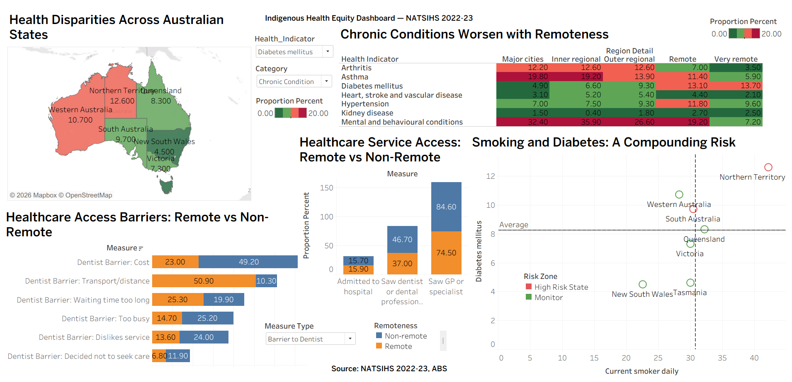

# Indigenous Health Equity Dashboard — NATSIHS 2022-23

## Overview
This project analyses the National Aboriginal and Torres Strait Islander Health Survey (NATSIHS) 2022-23 data from the Australian Bureau of Statistics to assess whether health services and outcomes are distributed fairly across Australian regions for Aboriginal and Torres Strait Islander communities.

Raw ABS data was cleaned and transformed in Excel, then imported into Tableau to build an interactive dashboard with five visualisations covering chronic disease prevalence, state-level disparities, risk factor relationships, and healthcare access barriers.

## Key Findings
- Diabetes prevalence nearly triples from 4.9% in major cities to 13.7% in very remote areas
- Northern Territory has the highest diabetes rate (12.6%) and daily smoking rate (42.2%) nationally
- Mental health condition rates appear lower in remote areas, likely reflecting under-diagnosis due to lack of services rather than better outcomes
- Transport is a barrier for 50.9% of remote Indigenous Australians needing dental care, compared to just 10.3% in non-remote areas
- Non-remote communities face different barriers: cost (49.2%) and waiting times (47.6%) dominate instead of transport
- Remote and non-remote communities need different policy solutions, not a one-size-fits-all approach

## Dashboard Preview

## Visualisations Built
| Chart | Purpose | Key Insight |
|-------|---------|-------------|
| Heatmap | Chronic conditions across 5 remoteness levels | Diabetes and hypertension worsen with remoteness |
| Filled Map | State-level health indicator comparison | NT is the most critical jurisdiction |
| Scatter Plot | Smoking vs diabetes by state with risk zones | NT has compounding risk — highest in both measures |
| Bar Chart | Healthcare access barriers by remoteness | Transport dominates remote barriers, cost dominates non-remote |
| Stacked Bar Chart | Service access rates by remoteness | GP access is 84.6% non-remote vs 74.5% remote |

## Tableau Features Used
- 4 calculated fields (IF/ELSEIF classifications and numeric benchmarking)
- Red-Green Diverging colour scale with custom center point (Start: 0, Center: 10, End: 20)
- Cross-sheet filters applied to selected worksheets
- Map used as interactive filter (clicking a state filters other charts)
- Custom tooltips with formatted health indicator context
- Stepped colour with 4 bands for consistent visual encoding

## Data Cleaning Process
The original ABS files contained logos, merged headers, multiple header rows, footnotes, and wide-format data. The cleaning process involved:
- Removing non-data elements (logos, metadata, footnotes)
- Creating a single header row with clear variable names
- Transforming wide format to long format for Tableau compatibility
- Creating separate sheets optimised for each visualisation type
- Verifying all cleaned values against the original ABS source tables

## Data Source
Australian Bureau of Statistics. (2024). National Aboriginal and Torres Strait Islander Health Survey, 2022-23.
https://www.abs.gov.au/statistics/people/aboriginal-and-torres-strait-islander-peoples/national-aboriginal-and-torres-strait-islander-health-survey/2022-23

## Ethical Framework
The analysis applies Justice and Fairness Ethics (Rawls, 1971) alongside the AIATSIS Code of Ethics (Impact and Value principle) to evaluate whether current health service distribution meets equitable standards for Indigenous Australians.

## Files
- `NATSIHS_Final.xlsx` — Cleaned and transformed dataset (4 sheets)
- `Assignment_1.twbx` — Tableau packaged workbook with all worksheets and dashboard
- `screenshots/` — Individual visualisation screenshots

## Tools
- Tableau Desktop (dashboard design and data visualisation)
- Microsoft Excel (data cleaning and transformation)

## Author
Lakshmi Miryala
Queensland University of Technology (QUT)
